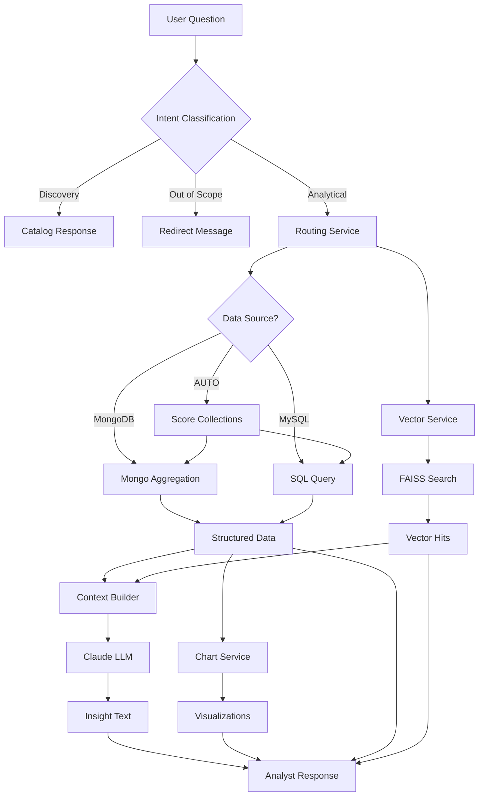

# AI Analyst Agent - End-to-End Working Explanation

## Overview

The AI Analyst Agent is a production-grade conversational analytics system that transforms natural language questions into accurate, database-backed insights. The system routes questions across MongoDB, MySQL, and a FAISS vector store, using Claude (Anthropic's LLM) strictly for explanation—never for computation.

**Critical Design Principle**: The LLM never computes business numbers. All aggregations are performed by databases, and the LLM only summarizes pre-computed results.

---

## System Architecture

```
┌─────────────────────────────────────────────────────────────────┐
│                         USER REQUEST                             │
│              POST /api/v1/analyze {question, ...}                │
└────────────────────────────┬────────────────────────────────────┘
                             │
                             ▼
┌─────────────────────────────────────────────────────────────────┐
│                    INTENT CLASSIFICATION                         │
│  • Discovery (catalog browsing)                                  │
│  • Out-of-scope (non-data questions)                            │
│  • Analytical (needs DB aggregation)                            │
│  • Semantic (needs context retrieval)                           │
│  • Comparison (multi-metric analysis)                           │
└────────────────────────────┬────────────────────────────────────┘
                             │
                ┌────────────┴────────────┐
                │                         │
        ┌───────▼────────┐       ┌───────▼────────┐
        │   DISCOVERY    │       │   ANALYTICAL   │
        │   Short-circuit│       │   Full Pipeline│
        └───────┬────────┘       └───────┬────────┘
                │                        │
                ▼                        ▼
        Return catalog          ┌────────────────┐
        summary                 │ ROUTING SERVICE│
                                │ (Rule-based +  │
                                │  LLM fallback) │
                                └───────┬────────┘
                                        │
                        ┌───────────────┼───────────────┐
                        │               │               │
                ┌───────▼──────┐ ┌─────▼─────┐ ┌──────▼──────┐
                │   MongoDB    │ │   MySQL   │ │   FAISS     │
                │  Aggregation │ │   Query   │ │   Search    │
                └───────┬──────┘ └─────┬─────┘ └──────┬──────┘
                        │               │               │
                        └───────────────┼───────────────┘
                                        │
                                ┌───────▼────────┐
                                │ CONTEXT BUILDER│
                                │ Trust + Data + │
                                │ Vector Context │
                                └───────┬────────┘
                                        │
                                ┌───────▼────────┐
                                │  CLAUDE (LLM)  │
                                │  Explanation   │
                                │  Only          │
                                └───────┬────────┘
                                        │
                                ┌───────▼────────┐
                                │ CHART SERVICE  │
                                │ (matplotlib +  │
                                │  Plotly +      │
                                │  ECharts)      │
                                └───────┬────────┘
                                        │
                                        ▼
                                ┌────────────────┐
                                │ ANALYST        │
                                │ RESPONSE       │
                                └────────────────┘
```

---

## Component Breakdown

### 1. **Entry Point: FastAPI Application** ([`main.py`](main.py:1))

The application starts with a FastAPI server that:
- Serves a chat UI at `/`
- Exposes REST API endpoints under `/api/v1`
- Handles CORS for cross-origin requests
- Provides custom error handling for domain exceptions

**Key Endpoints**:
- `POST /api/v1/analyze` - Main analytical endpoint
- `POST /api/v1/ingest` - Upload Excel/CSV/JSON files
- `GET /api/v1/health` - System health check
- `GET /api/v1/route` - Preview routing decisions (debug)
- `GET /api/v1/search` - Raw vector search (debug)

### 2. **API Routes Layer** ([`api/routes.py`](api/routes.py:1))

Handles HTTP request/response mapping:
- Validates incoming requests using Pydantic models
- Routes to appropriate service orchestrators
- Handles file uploads for data ingestion
- Manages AWQAF-specific JSON ingestion
- Returns structured responses with proper error codes

### 3. **Analyst Orchestrator** ([`services/analyst_service.py`](services/analyst_service.py:1))

The **heart of the system** - coordinates the entire analytical pipeline:

#### Pipeline Steps:

**Step 0: Intent Classification**
```python
# Cheap intent gate - handles discovery/out-of-scope without DB/LLM
intent_result = classify_intent(request.question)
if intent_result.intent == QuestionIntent.DISCOVERY:
    return self._handle_discovery(request, t0)
```

**Step 1: Routing Decision**
```python
decision = routing_service.decide(
    question, 
    collection=collection, 
    data_source=data_source
)
```

**Step 2: Execute Analytical Query**
```python
structured_data = self._run_analytical(
    decision,
    question=request.question,
    comparison=comparison_intent,
)
```

**Step 3: Retrieve Semantic Context**
```python
vector_hits = self._run_semantic(decision, request)
```

**Step 4: Build Trust Panel**
```python
trust_panel = self.trust.build(
    decision=decision,
    rows=structured_data,
    as_of=as_of,
)
```

**Step 5: Construct LLM Context**
```python
context_block = self.context.build(
    question=request.question,
    structured_data=structured_data,
    vector_hits=vector_hits,
    trust=trust_panel,
    warnings=warnings,
)
```

**Step 6: Generate Insight**
```python
insight = agent_service.generate_insight(
    request.question, 
    context_block
)
```

**Step 7: Render Charts**
```python
chart_panel = self._maybe_chart_panel(
    structured_data, 
    request, 
    decision, 
    quality
)
```

### 4. **Routing Service** ([`services/routing_service.py`](services/routing_service.py:1))

Determines how to answer a question using **rule-based logic** with **LLM fallback**:

#### Routing Logic:

**Operation Detection**:
```python
_AGG_KEYWORDS = {
    "sum": ["sum", "total", "totals", "revenue", "sales"],
    "avg": ["average", "avg", "mean"],
    "count": ["count", "how many", "number of"],
    "min": ["min", "minimum", "lowest"],
    "max": ["max", "maximum", "highest", "top"],
}
```

**Target Selection**:
- Scores collections/tables by token overlap with question
- Filters out metadata collections for metric queries
- Handles AWQAF-specific dataset routing

**Aggregation Spec Building**:
```python
AggregationSpec(
    operation="sum",           # sum/avg/count/min/max
    metric="total_transactions", # column to aggregate
    group_by="region",          # dimension to group by
    time=TimeSpec(              # temporal axis
        field="period",
        bucket=TimeBucket.MONTH,
        range_from=datetime(...),
        range_to=datetime(...)
    )
)
```

**LLM Fallback** (Build #6):
When rule-based routing is uncertain (no target, missing metric, etc.), the system optionally consults Claude for a second opinion.

### 5. **Database Services**

#### MongoDB Service ([`services/mongo_service.py`](services/mongo_service.py:1))

Executes aggregation pipelines:
```python
pipeline = [
    {"$match": filters},
    {"$group": {
        "_id": "$region",
        "value": {"$sum": "$total_transactions"}
    }},
    {"$sort": {"value": -1}},
    {"$limit": 10}
]
```

**Key Features**:
- Builds safe, parameterized aggregation pipelines
- Handles time bucketing (day/week/month/quarter/year)
- Supports group-by operations
- Implements comparison modes (YoY, previous period)

#### MySQL Service ([`services/mysql_service.py`](services/mysql_service.py:59))

Executes read-only SQL queries:
```python
# Read-only validation - rejects anything but SELECT
def run_sql(self, sql: str, limit: int = 1000) -> list[dict]:
    if not self._is_read_only(sql):
        raise DatabaseError("Only SELECT queries allowed")
    # Execute with SQLAlchemy
```

### 6. **Vector Service** ([`services/vector_service.py`](services/vector_service.py))

Semantic search using FAISS:

**Architecture**:
- Uses `sentence-transformers` for embeddings
- FAISS `IndexFlatIP` for inner product similarity
- JSON metadata sidecar for document linking
- Optional cross-encoder reranking

**Search Flow**:
```python
# 1. Embed query
query_vector = embedding_service.embed(question)

# 2. Search FAISS index
distances, indices = index.search(query_vector, top_k)

# 3. Retrieve metadata
hits = [metadata[idx] for idx in indices]

# 4. Optional reranking
if reranker_enabled:
    hits = reranker.rerank(question, hits)
```

### 7. **Context Service** ([`services/context_service.py`](services/context_service.py:1))

Builds the LLM prompt in **strict authority order**:

```
1. TRUST PANEL    — freshness, scope, definition source
2. STRUCTURED DATA — DB-computed rows (AUTHORITATIVE)
3. VECTOR CONTEXT  — informal docs (color only)
4. WARNINGS        — quality/governance signals
```

**Critical Rules**:
- Vector context can NEVER override structured data
- LLM is explicitly forbidden from recomputing numbers
- Trust panel facts must be restated in the answer

### 8. **Agent Service** ([`services/agent_service.py`](services/agent_service.py:1))

Claude integration with strict guardrails:

**System Prompt** (excerpt):
```
You are a senior data analyst writing for a business user.

Strict rules:
1. NEVER recompute numbers. STRUCTURED DATA is authoritative.
2. NEVER fabricate metrics, totals, periods, or rows.
3. Quote concrete numbers only when they appear in STRUCTURED DATA.
4. VECTOR CONTEXT is informal — it may add color but MUST NOT 
   redefine metrics or override numbers.
```

**Features**:
- Retry logic with exponential backoff
- Graceful degradation when LLM unavailable
- Token usage tracking
- Optional critic verification (Build #7)

### 9. **Chart Service** ([`services/chart_service.py`](services/chart_service.py:1))

Generates visualizations from DB data:

**Output Formats**:
- **PNG** (matplotlib) - base64-encoded for JSON responses
- **Plotly JSON** - interactive charts
- **ECharts** - dashboard-friendly defaults

**Chart Types**:
- Line charts (trends)
- Bar charts (comparisons)
- Pie/Donut charts (distributions)
- KPI cards (single metrics)
- Multi-series comparisons

**Intelligence**:
- Auto-detects partial months and marks them
- Handles year-month labels gracefully
- Applies metric-aware formatting (currency, percentages)
- Prevents misleading visualizations (e.g., pie chart with 1 slice)

### 10. **Ingestion Service** ([`services/ingestion_service.py`](services/ingestion_service.py))

Loads data into the system:

**Flow**:
```
Excel/CSV/JSON → pandas DataFrame → MongoDB documents → FAISS vectors
```

**Process**:
1. Parse file using pandas
2. Store each row as a MongoDB document
3. Generate text representation of each row
4. Embed text using sentence-transformers
5. Index vectors in FAISS with metadata

---

## Request Flow Example

### Example Question: "What is the total revenue by region in 2024?"

**1. Request Arrives**
```json
POST /api/v1/analyze
{
  "question": "What is the total revenue by region in 2024?",
  "collection": null,
  "data_source": "AUTO"
}
```

**2. Intent Classification**
```python
intent = classify_intent(question)
# Result: ANALYTICAL (has aggregation keywords)
```

**3. Routing Decision**
```python
decision = RoutingDecision(
    route=QueryRoute.ANALYTICAL,
    data_source=DataSource.MONGO,
    target="sales_data",
    aggregation=AggregationSpec(
        operation="sum",
        metric="revenue",
        group_by="region",
        time=TimeSpec(
            field="year",
            bucket=TimeBucket.YEAR,
            range_from=datetime(2024, 1, 1),
            range_to=datetime(2024, 12, 31)
        )
    )
)
```

**4. MongoDB Aggregation**
```python
pipeline = [
    {"$match": {"year": 2024}},
    {"$group": {
        "_id": "$region",
        "value": {"$sum": "$revenue"}
    }},
    {"$sort": {"value": -1}}
]
# Result: [
#   {"label": "North", "value": 1500000},
#   {"label": "South", "value": 1200000},
#   {"label": "East", "value": 980000}
# ]
```

**5. Vector Search** (parallel)
```python
hits = vector_service.search("revenue by region", top_k=5)
# Returns relevant documentation/context
```

**6. Context Building**
```
TRUST PANEL:
{
  "data_as_of": "2024-12-31T23:59:59Z",
  "target": "sales_data",
  "rows_analyzed": 3
}

STRUCTURED DATA:
[
  {"label": "North", "value": 1500000},
  {"label": "South", "value": 1200000},
  {"label": "East", "value": 980000}
]

VECTOR CONTEXT:
- [score=0.892] Revenue is tracked by sales region...
```

**7. LLM Insight Generation**
```python
insight = agent_service.generate_insight(question, context)
# Claude generates markdown explanation based on structured data
```

**8. Chart Generation**
```python
chart = chart_service.render(
    data=structured_data,
    chart_type=ChartType.BAR
)
# Generates bar chart PNG + Plotly JSON + ECharts option
```

**9. Response Assembly**
```json
{
  "question": "What is the total revenue by region in 2024?",
  "routing": {...},
  "structured_data": [...],
  "vector_context": [...],
  "insight": "## Summary\n\nBased on 2024 data...",
  "chart": {
    "chart_type": "bar",
    "image_base64": "iVBORw0KG...",
    "plotly_json": {...},
    "echarts_option": {...}
  },
  "trust": {...},
  "warnings": [],
  "meta": {
    "elapsed_ms": 847,
    "rows": 3,
    "vector_hits": 5
  }
}
```

---

## Key Design Patterns

### 1. **Separation of Concerns**

- **Routing**: Decides WHAT to do
- **Database**: Computes numbers
- **LLM**: Explains results
- **Charts**: Visualizes data

### 2. **Safety Guarantees**

**No Hallucinated Numbers**:
- LLM sees only pre-computed results
- System prompt explicitly forbids recomputation
- Charts built from same DB data

**Read-Only SQL**:
- MySQL service rejects non-SELECT queries
- All queries are parameterized

**Vector Traceability**:
- Every FAISS vector links to source document
- Metadata includes collection + document_id

### 3. **Graceful Degradation**

- LLM unavailable → deterministic fallback
- Database error → clear error message
- Missing data → honest "no data" response

### 4. **Caching Strategy**

- Schema cache (60s TTL)
- Glossary cache (300s TTL)
- Collection listing cache (60s TTL)
- Coverage probe cache (60s TTL)

### 5. **Session Management** (Build #5)

Supports conversational follow-ups:
```python
# First question
"Show monthly transactions for hajj-package-service in 2024"

# Follow-up (uses session context)
"Compare with 2025"  # System knows to use same dataset/metric
"By emirate"         # Adds group-by to previous query
```

### 6. **Quality Assurance**

**Trend Quality Checker**:
- Detects partial months
- Flags sparse data
- Validates time series continuity

**Trust Service**:
- Tracks data freshness
- Records data sources
- Documents metric definitions

**Critic Service** (Build #7):
- Self-verifies LLM responses
- Flags potential issues
- Optionally triggers revision

---

## Data Flow Diagram



---

## Advanced Features

### 1. **Glossary / Knowledge Base**

Curated metric definitions:
```python
MetricDefinition(
    id="active_customer",
    term="Active Customer",
    aliases=["active user", "engaged customer"],
    formula=MetricFormula(
        operation="count",
        filters={"status": "active"}
    ),
    status=MetricStatus.APPROVED
)
```

### 2. **Comparison Mode**

Multi-metric analysis:
```python
# Question: "Compare smart app and website transactions"
# System extracts multiple metrics and fans out queries
```

### 3. **Time Comparisons**

- Year-over-year (YoY)
- Previous period
- Custom date ranges

### 4. **AWQAF Data Integration**

Specialized ingestion for AWQAF datasets:
- Flattens nested JSON structures
- Handles multiple data shapes
- Maintains metadata catalog

### 5. **Observability**

- Request tracing with spans
- Token usage tracking
- Performance metrics
- Error logging

---

## Configuration

Key environment variables ([`.env`](.env:1)):

```bash
# LLM
ANTHROPIC_API_KEY=sk-ant-...
CLAUDE_MODEL=claude-sonnet-4-5-20241022
CLAUDE_MAX_TOKENS=4096

# Databases
MONGO_URI=mongodb://localhost:27017
MONGO_DB=ai_analyst
MYSQL_HOST=localhost
MYSQL_USER=root
MYSQL_DATABASE=ai_analyst

# Embeddings
EMBEDDING_MODEL=sentence-transformers/all-MiniLM-L6-v2

# Features
ROUTER_LLM_FALLBACK_ENABLED=true
CRITIC_ENABLED=true
SESSION_SUMMARY_ENABLED=true
```

---

## Testing & Debugging

**Debug Endpoints**:
- `GET /api/v1/route?question=...` - Preview routing
- `GET /api/v1/search?q=...` - Test vector search
- `GET /api/v1/collections` - List available data

**Logging**:
- Structured logging with loguru
- Request/response tracing
- Performance metrics

---

## Deployment Considerations

**Production Checklist**:
1. Set `APP_ENV=production`
2. Use managed MongoDB (Atlas)
3. Use managed MySQL
4. Configure proper CORS origins
5. Add authentication middleware
6. Set up monitoring (Prometheus)
7. Configure rate limiting
8. Use HTTPS/TLS

**Scaling**:
- Stateless design (horizontal scaling)
- Database connection pooling
- FAISS index can be upgraded to HNSW/IVF for large corpora
- Consider caching layer (Redis) for high traffic

---

## Summary

The AI Analyst Agent is a sophisticated yet maintainable system that:

1. **Routes** natural language questions intelligently
2. **Computes** accurate numbers using databases
3. **Retrieves** relevant context from vector store
4. **Explains** results using Claude (never computing)
5. **Visualizes** data with multiple chart formats
6. **Tracks** data quality and freshness
7. **Supports** conversational follow-ups

The architecture ensures **no hallucinated numbers** by keeping computation in databases and using the LLM strictly for explanation. This design makes the system both powerful and trustworthy for business analytics.
