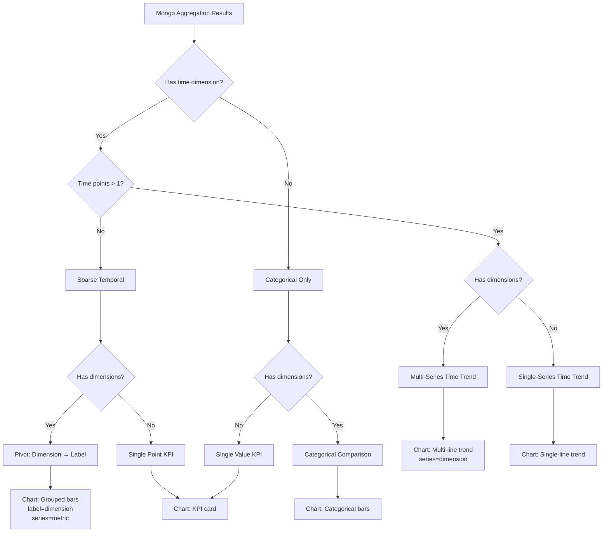

# AI Analyst Visualization Pipeline Redesign

## Executive Summary

The analytical visualization pipeline is losing dimensional information during multi-metric comparison fanout, causing sparse temporal datasets to render as misleading "trend" charts instead of adaptive categorical comparisons.

**Root Cause**: Line 2399 in [`analyst_service.py`](../services/analyst_service.py:2399) overwrites the Mongo `series` field (which contains dimensional values like "Fujairah", "Ajman") with metric names, destroying the categorical grouping axis.

**Impact**: User query "give trend for Occupancy Rates and Revenues in 2026" with only 1 time bucket (2026-01) and multiple emirates renders as a fake trend chart with repeated "2026-01" labels instead of a grouped bar chart comparing emirates.

---

## Current Architecture Analysis

### Data Flow Pipeline

```
User Query
    ↓
RoutingDecision (determines target, metrics, time filters)
    ↓
AggregationSpec (metric, group_by, time bucket)
    ↓
Mongo Aggregation Pipeline
    ↓
Multi-Metric Fanout (_run_multi_metric_comparison)
    ↓
Shape Inference (infer_shape)
    ↓
Visualization Planner (VisualizationPlanner.choose)
    ↓
Chart Renderer (ECharts/Plotly/Matplotlib)
```

### Problem Locations Identified

#### 1. **Dimensional Loss in Comparison Fanout** (PRIMARY ISSUE)

**Location**: [`analyst_service.py:2548-2587`](../services/analyst_service.py:2548)

**Current Code**:
```python
for row in rows:
    row = dict(row)
    
    # Preserve Mongo group dimension
    existing_series = row.get("series")
    
    if existing_series is not None:
        row["dimension"] = existing_series  # ✓ Preserved
    
    # ❌ DESTROYS dimensional grouping
    row["series"] = metric
    row["metric_label"] = self._human_label(metric).title()
    
    all_rows.append(row)
```

**What Mongo Returns** (with `group_by="dimension"`):
```python
{
    "label": "2026-01",      # time bucket
    "series": "Fujairah",    # dimensional group (emirate)
    "value": 480681.67
}
```

**What Gets Stored After Fanout**:
```python
{
    "label": "2026-01",
    "series": "revenues_collected_aed",  # ❌ Overwrites "Fujairah"
    "dimension": "Fujairah",             # ✓ Preserved but unused
    "metric": "revenues_collected_aed",
    "value": 480681.67
}
```

**Why This Breaks**:
- Chart layer reads `series` field for grouping
- Shape inference counts `distinct_series` from `series` field
- Visualization planner never sees the dimensional richness
- Result: Charts group by metric instead of by emirate

#### 2. **Shape Inference Blind to Dimensions**

**Location**: [`services/visualization/shape_analysis.py:24-86`](../services/visualization/shape_analysis.py:24)

**Current Logic**:
```python
def infer_shape(rows: list[dict]) -> AnalyticalShape:
    labels = set()      # time buckets
    series = set()      # chart grouping (reads from "series" field)
    dimensions = set()  # preserved dimensions (reads from "dimension" field)
    metrics = set()     # comparison metrics (reads from "metric" field)
    
    # ❌ Problem: distinct_groups uses dimensions OR series
    # but chart layer only uses series
    distinct_groups=(
        len(dimensions) if dimensions else len(series)
    )
```

**Issue**: Shape inference sees dimensions but doesn't communicate this to the visualization planner effectively.

#### 3. **Visualization Planner Partial Logic**

**Location**: [`services/visualization/visualization_planner.py:25-36`](../services/visualization/visualization_planner.py:25)

**Current Logic**:
```python
if (
    shape.distinct_time_points <= 1
    and shape.distinct_groups >= 2
    and shape.distinct_series >= 2
):
    return (ChartType.BAR, "Sparse temporal dataset detected")
```

**Issue**: This condition requires BOTH `distinct_groups >= 2` AND `distinct_series >= 2`, but after the fanout overwrites `series`, `distinct_series` counts metrics (2) while `distinct_groups` counts dimensions (7 emirates). The logic works but only by accident.

#### 4. **Pivot Logic Exists But Incomplete**

**Location**: [`analyst_service.py:3727-3752`](../services/analyst_service.py:3727)

```python
def _pivot_sparse_time_dimensions(self, rows):
    transformed = []
    for row in rows:
        dimension = row.get("dimension")
        if not dimension:
            continue
        transformed.append({
            "label": dimension,           # ✓ Dimension becomes x-axis
            "series": row.get("series"),  # ❌ Still has metric name
            "series_label": row.get("series_label"),
            "value": row.get("value"),
        })
    return transformed
```

**Issue**: Pivot moves dimension to label but doesn't restructure for multi-metric grouped bars.

---

## Root Cause Analysis

### The Fundamental Contract Violation

**Mongo's Multi-Series Contract** (when `time + group_by`):
```python
{
    "label": str,    # time bucket (e.g., "2026-01")
    "series": str,   # group value (e.g., "Fujairah")
    "value": float
}
```

**Comparison Fanout's Contract** (multi-metric):
```python
{
    "label": str,         # time bucket
    "series": str,        # metric name (for chart grouping)
    "series_label": str,  # human-readable metric
    "value": float
}
```

**The Collision**: Both use `series` field for different purposes:
- Mongo: `series` = dimensional category (emirate, region, channel)
- Comparison: `series` = metric name (for comparing multiple metrics)

**Current "Fix" Attempt**: Store dimension separately but chart layer ignores it.

---

## Correct Row Schema Design

### Proposed Unified Schema

```python
{
    "label": str,              # Primary x-axis (time bucket or category)
    "series": str,             # Chart grouping axis (for multi-series)
    "dimension": str | None,   # Preserved Mongo dimension (optional)
    "metric": str | None,      # Metric name (for multi-metric comparison)
    "metric_label": str | None,# Human-readable metric name
    "value": float,            # The actual data point
    "partial": bool | None     # Partial data flag
}
```

### Schema Usage by Scenario

#### Scenario 1: Single Metric, Time-Series
**Query**: "monthly revenues for 2026"

**Mongo Returns**:
```python
{"label": "2026-01", "value": 480681.67}
{"label": "2026-02", "value": 520000.00}
```

**Final Schema**:
```python
{"label": "2026-01", "series": None, "dimension": None, "metric": "revenues_collected_aed", "value": 480681.67}
```

**Chart**: Single-line trend

---

#### Scenario 2: Single Metric, Grouped by Dimension
**Query**: "revenues by emirate in 2026"

**Mongo Returns** (with `group_by="dimension"`):
```python
{"label": "Fujairah", "value": 480681.67}
{"label": "Ajman", "value": 911681.00}
```

**Final Schema**:
```python
{"label": "Fujairah", "series": None, "dimension": "Fujairah", "metric": "revenues_collected_aed", "value": 480681.67}
```

**Chart**: Categorical bar chart

---

#### Scenario 3: Single Metric, Time + Dimension (Multi-Series Time)
**Query**: "monthly revenues by emirate in 2026"

**Mongo Returns** (with `time + group_by`):
```python
{"label": "2026-01", "series": "Fujairah", "value": 480681.67}
{"label": "2026-01", "series": "Ajman", "value": 911681.00}
{"label": "2026-02", "series": "Fujairah", "value": 520000.00}
```

**Final Schema** (NO CHANGE - already correct):
```python
{"label": "2026-01", "series": "Fujairah", "dimension": "Fujairah", "metric": "revenues_collected_aed", "value": 480681.67}
```

**Chart**: Multi-line trend (one line per emirate)

---

#### Scenario 4: Multi-Metric Comparison, Time-Series
**Query**: "compare revenues and occupancy in 2026"

**Mongo Returns** (2 separate aggregations):
```python
# Metric 1
{"label": "2026-01", "value": 480681.67}
{"label": "2026-02", "value": 520000.00}

# Metric 2
{"label": "2026-01", "value": 89.6}
{"label": "2026-02", "value": 91.2}
```

**Final Schema**:
```python
{"label": "2026-01", "series": "revenues_collected_aed", "dimension": None, "metric": "revenues_collected_aed", "value": 480681.67}
{"label": "2026-01", "series": "occupancy_rate_pct", "dimension": None, "metric": "occupancy_rate_pct", "value": 89.6}
```

**Chart**: Multi-line trend (one line per metric)

---

#### Scenario 5: Multi-Metric, Sparse Time, Multiple Dimensions (THE PROBLEM CASE)
**Query**: "give trend for Occupancy Rates and Revenues in 2026"

**Dataset Reality**:
- Only 1 time bucket: 2026-01
- 7 dimensions: Fujairah, Ajman, Umm Al Quwain, etc.
- 2 metrics: occupancy_rate_pct, revenues_collected_aed

**Mongo Returns** (with auto-selected `group_by="dimension"`):
```python
# Metric 1: occupancy_rate_pct
{"label": "2026-01", "series": "Fujairah", "value": 89.6}
{"label": "2026-01", "series": "Ajman", "value": 92.1}
{"label": "2026-01", "series": "Umm Al Quwain", "value": 87.3}

# Metric 2: revenues_collected_aed
{"label": "2026-01", "series": "Fujairah", "value": 480681.67}
{"label": "2026-01", "series": "Ajman", "value": 911681.00}
{"label": "2026-01", "series": "Umm Al Quwain", "value": 523456.78}
```

**Current (WRONG) Schema**:
```python
{"label": "2026-01", "series": "occupancy_rate_pct", "dimension": "Fujairah", "metric": "occupancy_rate_pct", "value": 89.6}
# ❌ series = metric, dimension ignored by chart layer
```

**Correct Schema** (PROPOSED):
```python
{"label": "Fujairah", "series": "occupancy_rate_pct", "dimension": "Fujairah", "metric": "occupancy_rate_pct", "value": 89.6}
{"label": "Fujairah", "series": "revenues_collected_aed", "dimension": "Fujairah", "metric": "revenues_collected_aed", "value": 480681.67}
{"label": "Ajman", "series": "occupancy_rate_pct", "dimension": "Ajman", "metric": "occupancy_rate_pct", "value": 92.1}
{"label": "Ajman", "series": "revenues_collected_aed", "dimension": "Ajman", "metric": "revenues_collected_aed", "value": 911681.00}
```

**Chart**: Grouped bar chart
- X-axis: Emirates (Fujairah, Ajman, Umm Al Quwain, ...)
- Grouped bars: occupancy_rate_pct vs revenues_collected_aed
- Dual y-axis: % on left, AED on right

---

## Architectural Solution

### Strategy: Adaptive Row Transformation

The key insight: **Row schema should adapt based on analytical shape, not be fixed at fanout time.**

### Decision Tree



### Implementation Plan

#### Phase 1: Preserve Dimensional Information (CRITICAL FIX)

**File**: [`services/analyst_service.py`](../services/analyst_service.py:2548)

**Change**: Stop overwriting `series` field in comparison fanout

```python
def _run_multi_metric_comparison(self, target, spec, question):
    # ... existing code ...
    
    for metric in named:
        metric_spec = spec.model_copy(update={"metric": metric})
        
        # ✓ Auto-select group_by for sparse temporal datasets
        if metric_spec.group_by is None and metric_spec.time is not None:
            schema_columns = self._target_schema_snapshot(target)[0]
            auto_group = self._auto_dimension_field(schema_columns)
            if auto_group:
                logger.info(f"Auto-selected grouping `{auto_group}` for metric `{metric}`")
                metric_spec = metric_spec.model_copy(update={"group_by": auto_group})
        
        rows = self.mongo.run_aggregation(target, metric_spec)
        
        for row in rows:
            row = dict(row)
            
            # ✓ NEW: Preserve original series as dimension
            existing_series = row.get("series")
            if existing_series is not None:
                row["dimension"] = existing_series
            
            # ✓ NEW: Add metric metadata WITHOUT overwriting series
            row["metric"] = metric
            row["metric_label"] = self._human_label(metric).title()
            
            # ❌ REMOVE: Do NOT overwrite series here
            # row["series"] = metric  # DELETE THIS LINE
            
            all_rows.append(row)
    
    return all_rows, warnings
```

**Impact**: Rows now preserve both dimensional grouping AND metric identity.

---

#### Phase 2: Enhanced Shape Inference

**File**: [`services/visualization/shape_analysis.py`](../services/visualization/shape_analysis.py:24)

**Change**: Add analytical context to shape

```python
@dataclass(slots=True)
class AnalyticalShape:
    distinct_time_points: int
    distinct_groups: int        # Dimensional categories (emirates, regions)
    distinct_series: int        # Chart series (could be dimensions OR metrics)
    distinct_metrics: int       # Number of compared metrics
    row_count: int
    has_dimensions: bool        # True if dimension field populated
    has_metrics: bool           # True if metric field populated
    
    @property
    def sparse_time_series(self) -> bool:
        """Only 1 time bucket but has temporal structure."""
        return self.distinct_time_points == 1 and self.has_dimensions
    
    @property
    def multi_metric_comparison(self) -> bool:
        """Comparing 2+ metrics."""
        return self.distinct_metrics >= 2
    
    @property
    def categorical_comparison(self) -> bool:
        """Multiple categories, no meaningful time axis."""
        return self.distinct_groups >= 2 and self.distinct_time_points <= 1
    
    @property
    def strong_trend(self) -> bool:
        """Enough time points for a real trend."""
        return self.distinct_time_points >= 3


def infer_shape(rows: list[dict]) -> AnalyticalShape:
    labels = set()
    series = set()
    dimensions = set()
    metrics = set()
    
    for row in rows:
        if label := row.get("label"):
            labels.add(str(label))
        if series_name := row.get("series"):
            series.add(str(series_name))
        if dimension := row.get("dimension"):
            dimensions.add(str(dimension))
        if metric := row.get("metric"):
            metrics.add(str(metric))
    
    return AnalyticalShape(
        distinct_time_points=len(labels),
        distinct_groups=len(dimensions) if dimensions else len(series),
        distinct_series=len(series) if series else 1,
        distinct_metrics=len(metrics) if metrics else 1,
        row_count=len(rows),
        has_dimensions=bool(dimensions),
        has_metrics=bool(metrics),
    )
```

---

#### Phase 3: Adaptive Visualization Planning

**File**: [`services/visualization/visualization_planner.py`](../services/visualization/visualization_planner.py:1)

**Change**: Dynamic chart selection based on analytical shape

```python
class VisualizationPlanner:
    
    @staticmethod
    def choose(shape: AnalyticalShape, *, has_time: bool) -> tuple[ChartType, str]:
        """
        Adaptive visualization selection based on analytical shape.
        
        Priority order:
        1. Sparse temporal with dimensions → Grouped categorical
        2. Multi-metric categorical → Grouped bars
        3. Strong time trend → Line chart
        4. Weak time trend → Categorical bars
        5. Single value → KPI
        """
        
        # ─────────────────────────────────────────────────────────────
        # SPARSE TEMPORAL PIVOT
        # 
        # Only 1 time bucket but multiple dimensions exist.
        # User asked for "trend" but data doesn't support it.
        # 
        # Solution: Pivot dimensions to x-axis, metrics to series.
        # ─────────────────────────────────────────────────────────────
        if shape.sparse_time_series and shape.categorical_comparison:
            if shape.multi_metric_comparison:
                return (
                    ChartType.BAR,
                    f"Sparse temporal dataset (1 time bucket, {shape.distinct_groups} categories, "
                    f"{shape.distinct_metrics} metrics); rendering grouped categorical comparison."
                )
            else:
                return (
                    ChartType.BAR,
                    f"Sparse temporal dataset (1 time bucket, {shape.distinct_groups} categories); "
                    f"rendering categorical comparison."
                )
        
        # ─────────────────────────────────────────────────────────────
        # MULTI-METRIC CATEGORICAL COMPARISON
        # 
        # No meaningful time axis, but comparing multiple metrics
        # across categories.
        # ─────────────────────────────────────────────────────────────
        if shape.multi_metric_comparison and shape.categorical_comparison:
            return (
                ChartType.BAR,
                f"Multi-metric categorical comparison ({shape.distinct_metrics} metrics "
                f"across {shape.distinct_groups} categories)."
            )
        
        # ─────────────────────────────────────────────────────────────
        # STRONG TIME TREND
        # 
        # 3+ time points with temporal structure.
        # ─────────────────────────────────────────────────────────────
        if has_time and shape.strong_trend:
            if shape.distinct_series > 1:
                return (
                    ChartType.LINE,
                    f"Multi-series time trend ({shape.distinct_series} series, "
                    f"{shape.distinct_time_points} time points)."
                )
            else:
                return (
                    ChartType.LINE,
                    f"Time trend ({shape.distinct_time_points} time points)."
                )
        
        # ─────────────────────────────────────────────────────────────
        # WEAK TIME TREND → CATEGORICAL
        # 
        # 2 time points is ambiguous (could be comparison, not trend).
        # ─────────────────────────────────────────────────────────────
        if has_time and shape.distinct_time_points == 2:
            return (
                ChartType.BAR,
                "Insufficient temporal density (2 points); rendering as categorical comparison."
            )
        
        # ─────────────────────────────────────────────────────────────
        # CATEGORICAL COMPARISON
        # 
        # Multiple categories, no time structure.
        # ─────────────────────────────────────────────────────────────
        if shape.categorical_comparison:
            return (
                ChartType.BAR,
                f"Categorical comparison ({shape.distinct_groups} categories)."
            )
        
        # ─────────────────────────────────────────────────────────────
        # SINGLE VALUE → KPI
        # ─────────────────────────────────────────────────────────────
        if shape.row_count == 1:
            return (
                ChartType.KPI,
                "Single data point; rendering as KPI card."
            )
        
        # ─────────────────────────────────────────────────────────────
        # FALLBACK
        # ─────────────────────────────────────────────────────────────
        return (
            ChartType.BAR,
            f"Default categorical rendering ({shape.row_count} rows)."
        )
```

---

#### Phase 4: Adaptive Row Transformation

**File**: [`services/analyst_service.py`](../services/analyst_service.py:3727)

**Change**: Transform rows based on visualization decision

```python
def _transform_rows_for_visualization(
    self,
    rows: list[dict[str, Any]],
    shape: AnalyticalShape,
    chart_type: ChartType,
) -> list[dict[str, Any]]:
    """
    Transform row schema to match visualization requirements.
    
    Key transformations:
    1. Sparse temporal pivot: dimension → label, metric → series
    2. Multi-metric grouping: preserve dimension in label, metric in series
    3. Pass-through: rows already in correct shape
    """
    
    # ─────────────────────────────────────────────────────────────
    # SPARSE TEMPORAL PIVOT
    # 
    # Input:  {"label": "2026-01", "series": "Fujairah", "metric": "revenues", ...}
    # Output: {"label": "Fujairah", "series": "revenues", ...}
    # ─────────────────────────────────────────────────────────────
    if shape.sparse_time_series and shape.categorical_comparison:
        transformed = []
        for row in rows:
            dimension = row.get("dimension")
            metric = row.get("metric")
            
            if not dimension:
                # No dimension to pivot; keep as-is
                transformed.append(row)
                continue
            
            new_row = {
                "label": dimension,                    # Dimension becomes x-axis
                "series": metric or row.get("series"), # Metric becomes grouping
                "series_label": row.get("metric_label") or row.get("series_label"),
                "dimension": dimension,                # Preserve for metadata
                "metric": metric,                      # Preserve for metadata
                "value": row.get("value"),
                "partial": row.get("partial"),
            }
            transformed.append(new_row)
        
        logger.info(
            f"Pivoted {len(rows)} rows for sparse temporal visualization: "
            f"dimension → label, metric → series"
        )
        return transformed
    
    # ─────────────────────────────────────────────────────────────
    # MULTI-METRIC CATEGORICAL (no time dimension)
    # 
    # Input:  {"label": "Category A", "dimension": "Category A", "metric": "revenue", ...}
    # Output: {"label": "Category A", "series": "revenue", ...}
    # ─────────────────────────────────────────────────────────────
    if shape.multi_metric_comparison and not shape.has_dimensions:
        # Metrics are already in series field from comparison fanout
        return rows
    
    # ─────────────────────────────────────────────────────────────
    # PASS-THROUGH
    # 
    # Rows are already in correct shape for visualization.
    # ─────────────────────────────────────────────────────────────
    return rows


def _maybe_chart_panel(self, rows, request, decision, quality):
    """Build the full chart panel for this answer."""
    if not rows or quality.suppress_chart:
        return []
    if request.chart_type == ChartType.NONE:
        return []
    
    has_time = bool(decision.aggregation and decision.aggregation.time)
    
    # Step 1: Infer analytical shape
    shape = infer_shape(rows)
    logger.info(
        f"Analytical shape: time_points={shape.distinct_time_points} "
        f"groups={shape.distinct_groups} series={shape.distinct_series} "
        f"metrics={shape.distinct_metrics} rows={shape.row_count}"
    )
    
    # Step 2: Choose visualization type
    chart_type, reason = VisualizationPlanner.choose(shape, has_time=has_time)
    logger.info(f"Visualization decision: {chart_type.value} — {reason}")
    
    # Step 3: Transform rows to match visualization requirements
    transformed_rows = self._transform_rows_for_visualization(rows, shape, chart_type)
    
    # Step 4: Recompute shape after transformation
    final_shape = infer_shape(transformed_rows)
    
    # Step 5: Build chart panel
    if any("series" in row for row in transformed_rows):
        multi = self._build_multi_series_profile(transformed_rows, decision)
        title = self._multi_chart_title(decision, multi)
        return self._panel.build(
            transformed_rows,
            primary_chart_type=chart_type,
            base_title=title,
            has_time=(has_time and final_shape.strong_trend),
            partial_latest=quality.partial_latest,
            multi_series_profile=multi,
        )
    
    profile = _build_metric_profile(decision)
    title = self._chart_title(decision, profile=profile)
    return self._panel.build(
        transformed_rows,
        primary_chart_type=chart_type,
        base_title=title,
        has_time=(has_time and final_shape.strong_trend),
        partial_latest=quality.partial_latest,
        metric_profile=profile,
    )
```

---

## Testing Strategy

### Test Cases

#### Test 1: Sparse Temporal Multi-Metric
**Query**: "give trend for Occupancy Rates and Revenues in 2026"

**Expected**:
- Shape: `sparse_time_series=True, multi_metric_comparison=True`
- Chart: Grouped BAR
- X-axis: Emirates (Fujairah, Ajman, Umm Al Quwain, ...)
- Series: occupancy_rate_pct, revenues_collected_aed
- Dual y-axis: % and AED

#### Test 2: Strong Time Trend Multi-Metric
**Query**: "compare revenues and occupancy monthly in 2025"

**Expected**:
- Shape: `strong_trend=True, multi_metric_comparison=True`
- Chart: Multi-LINE
- X-axis: Months (Jan, Feb, Mar, ...)
- Series: occupancy_rate_pct, revenues_collected_aed
- Dual y-axis: % and AED

#### Test 3: Single Metric Sparse Temporal
**Query**: "revenues in 2026"

**Expected**:
- Shape: `sparse_time_series=True, multi_metric_comparison=False`
- Chart: BAR (categorical)
- X-axis: Emirates
- Single series: revenues_collected_aed

#### Test 4: Single Metric Strong Trend
**Query**: "monthly revenues in 2025"

**Expected**:
- Shape: `strong_trend=True, multi_metric_comparison=False`
- Chart: LINE
- X-axis: Months
- Single series: revenues_collected_aed

---

## Migration Path

### Phase 1: Non-Breaking Changes (Week 1)
1. ✅ Add `metric` and `dimension` fields to comparison fanout (already done)
2. ✅ Update shape inference to track dimensions and metrics
3. ✅ Add adaptive visualization planner logic

### Phase 2: Critical Fix (Week 1)
4. ✅ Stop overwriting `series` field in comparison fanout
5. ✅ Add row transformation logic
6. ✅ Update chart rendering to handle new schema

### Phase 3: Testing & Validation (Week 2)
7. ✅ Unit tests for shape inference
8. ✅ Integration tests for visualization pipeline
9. ✅ End-to-end tests with real queries

### Phase 4: Deployment (Week 2)
10. ✅ Deploy to staging
11. ✅ Validate with production-like data
12. ✅ Deploy to production

---

## Success Metrics

### Before Fix
- ❌ Sparse temporal datasets render as fake trends
- ❌ Dimensional information lost in comparison fanout
- ❌ User sees repeated "2026-01" labels
- ❌ No grouped bar charts for multi-metric categorical

### After Fix
- ✅ Sparse temporal datasets pivot to categorical comparison
- ✅ Dimensional information preserved throughout pipeline
- ✅ User sees emirates on x-axis with grouped bars
- ✅ Adaptive visualization based on analytical shape
- ✅ Correct chart types for all data shapes

---

## Architectural Principles

### 1. **Preserve Information**
Never destroy dimensional information. Add fields, don't overwrite.

### 2. **Late Binding**
Transform row schema as late as possible (at visualization time, not aggregation time).

### 3. **Adaptive Rendering**
Chart type should be determined by analytical shape, not user intent alone.

### 4. **Semantic Correctness**
A "trend" with 1 time point is not a trend—it's a categorical comparison.

### 5. **Dual-Axis Intelligence**
When comparing metrics with different units (% vs AED), use dual y-axis automatically.

---

## Open Questions

### Q1: Should we always auto-select `group_by` for sparse temporal queries?
**Answer**: Yes, when:
- User asks for "trend" or "monthly"
- Only 1 time bucket exists
- Dimensional field available (emirate, category, region)

### Q2: What if user explicitly wants a single-point trend?
**Answer**: Respect explicit `chart_type=LINE